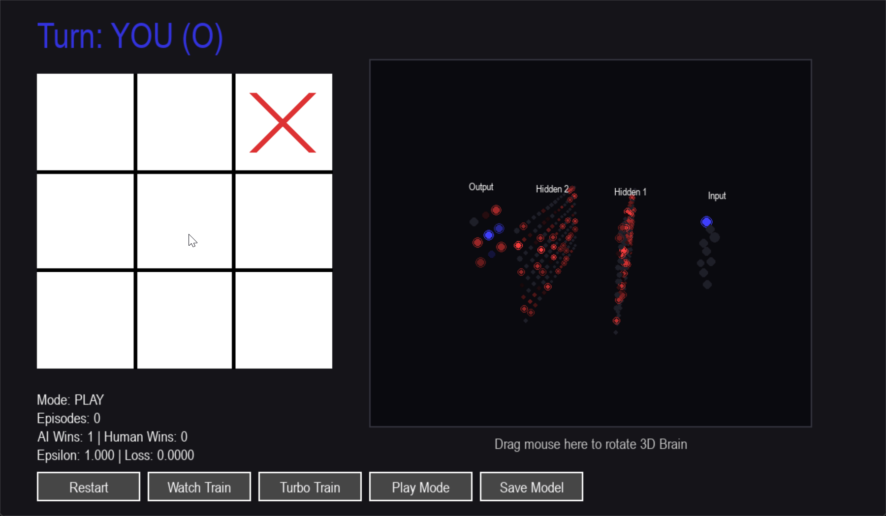
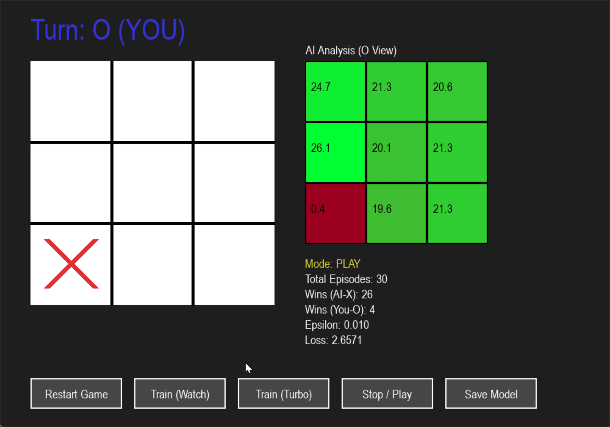
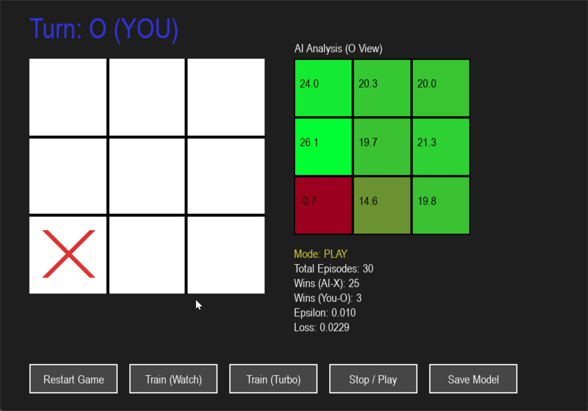

# 🧠 Deep Q-Network Tic-Tac-Toe with 3D Neural Visualization

A Reinforcement Learning project that teaches an AI to play Tic-Tac-Toe from scratch using Deep Q-Networks (DQN). This project features atraining pipeline, a CLI interface, and two distinct visualization GUIs (2D Heatmap & 3D Neural Network).

## 📸 Demo

### 3D Neural Visualization (Main)

Watch the neural network's hidden layers activate in real-time as the AI "thinks" about its next move.


### Fast Training (Turbo Mode)

The AI training against itself at high speed.


### 2D Decision Map (Legacy)

The earlier version showing the Q-Value heatmap on a 2D plane.


## ✨ Key Features

- Deep Q-Network (DQN): Implements a classic DQN architecture with Experience Replay and Target Networks using PyTorch.
- Interactive 3D Visualization: A custom 3D engine renders the neural network layers (Input → Hidden → Output), showing neuron activation intensity.
- 2D Decision Heatmap: A 2D mode that overlays the AI's confidence levels (Q-values) directly onto the grid.
- Self-Play Training: The AI trains by playing against itself, learning strategies without human intervention.
- Turbo Training Mode: A high-speed training mode in the GUI that runs hundreds of games per second.
- Replay System: Record games and watch them back frame-by-frame using the visualizer.

## 📦 Installation

Ensure you have Python 3.x installed. Install the required dependencies:

```bash
pip install torch gym numpy pygame colorama
```

(Note: colorama is optional but recommended for terminal output)

## 🚀 Quick Start

### 1. 3D Visualization (Recommended)

The latest version with the 3D brain view.

```bash
python game_gui_3d.py
```

Controls:  
Play: You are O (Blue). AI is X (Red).  
Rotate 3D View: Click and drag on the right side of the screen.  
Turbo Train: Speeds up training (visuals may lag slightly due to math intensity).

### 2. 2D Decision Map

The lightweight version focusing on the Q-Value heatmap.

```bash
python game_gui_2d.py
```

### 3. Console / Terminal Play

Play against the AI or watch two humans play in the terminal.

```bash
python game_console.py
```

## 📂 File Structure

| File              | Description                                                           |
| ----------------- | --------------------------------------------------------------------- |
| game_gui_3d.py    | Main 3D Application. PyGame UI with the 3D Neural Network Visualizer. |
| game_gui_2d.py    | 2D Application. PyGame UI with the 2D Q-Value Heatmap visualization.  |
| game_console.py   | Terminal-based interface for playing or training without a GUI.       |
| train.py          | Headless, high-speed training script (best for server training).      |
| visualizer.py     | Replays saved games (.json) from the game_logs folder.                |
| dqn_agent.py      | PyTorch DQN model class and Agent logic (Replay Buffer, Learning).    |
| tictactoe_env.py  | Custom OpenAI Gym Environment for Tic-Tac-Toe.                        |
| utils.py          | Utilities for saving/loading game logs.                               |
| tictactoe_dqn.pth | The trained model weights.                                            |

## 🧠 How It Works

### The State

The board is represented as a flattened array of size 9 (0=Empty, 1=AI, -1=Opponent).

### The Agent (DQN)

Input: 9 neurons (Board State).  
Hidden Layers: Two fully connected layers of 128 neurons each (ReLU).  
Output: 9 neurons (Q-Values), representing the expected reward for each square.

3D View: The game_gui_3d.py extracts the raw activation values from the hidden layers during the forward pass and renders them as glowing nodes in 3D space.

### Training Process

Observe: The agent sees the current board.  
Act: It picks a move based on its policy.  
Reward: +10 (Win), -10 (Invalid Move), 0 (Draw/Continue).  
Learn: Transitions are stored in a Replay Buffer and sampled to update the network weights.
